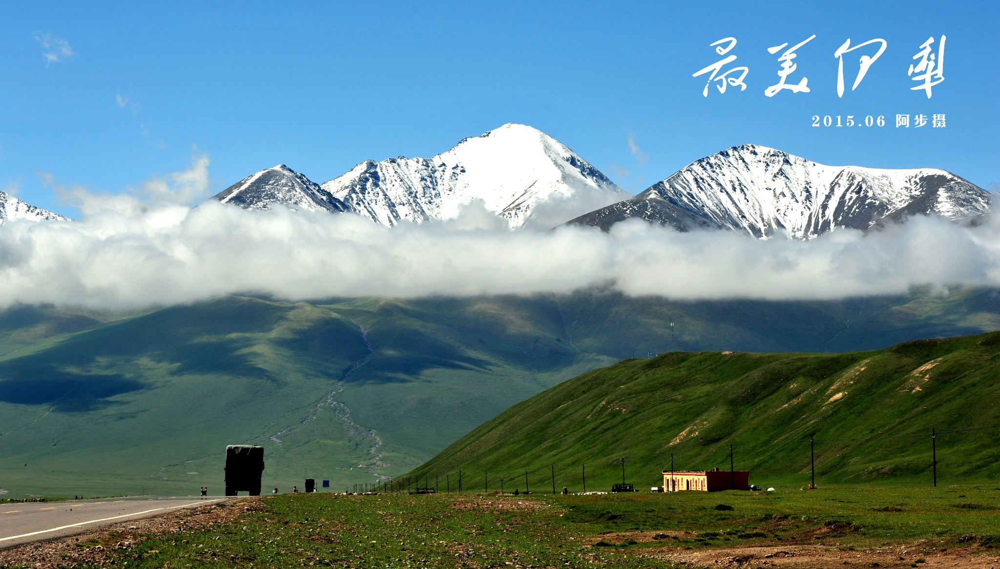
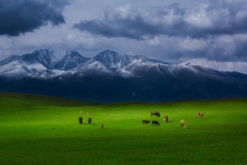
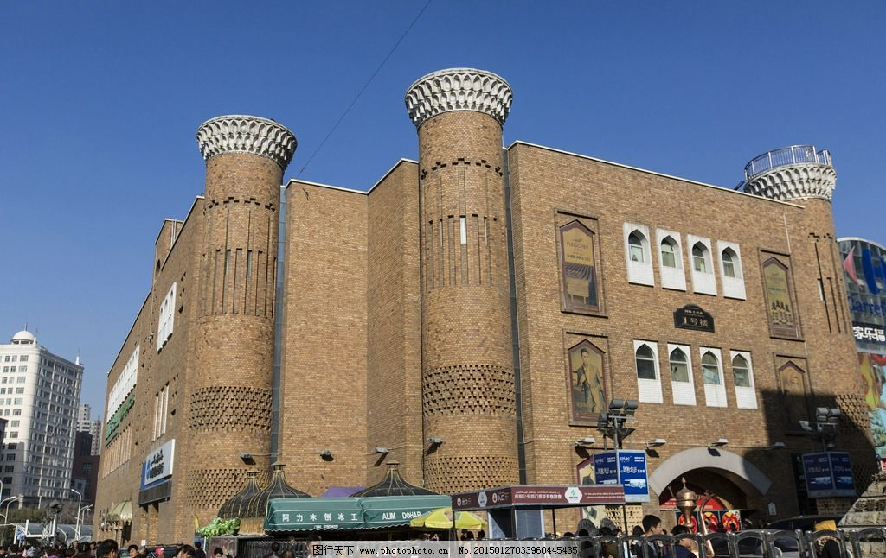
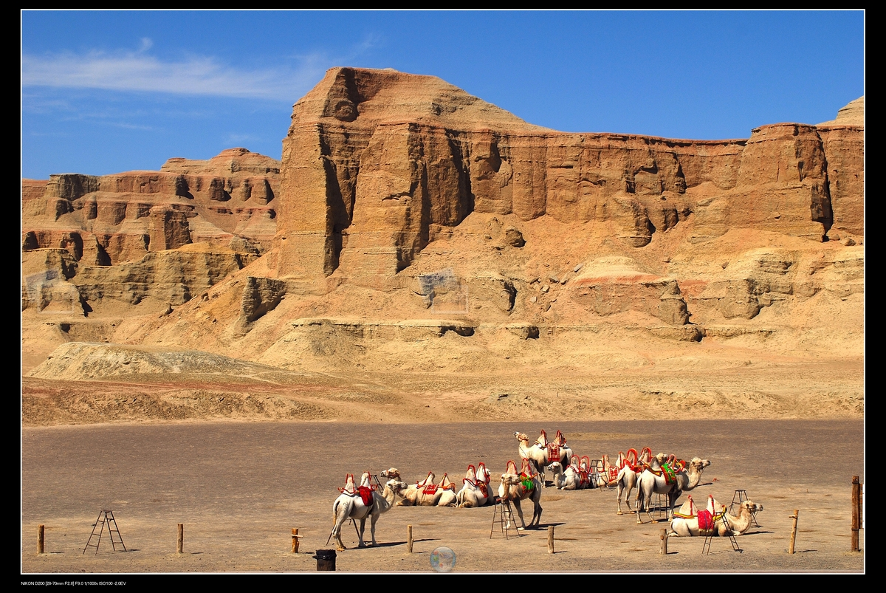
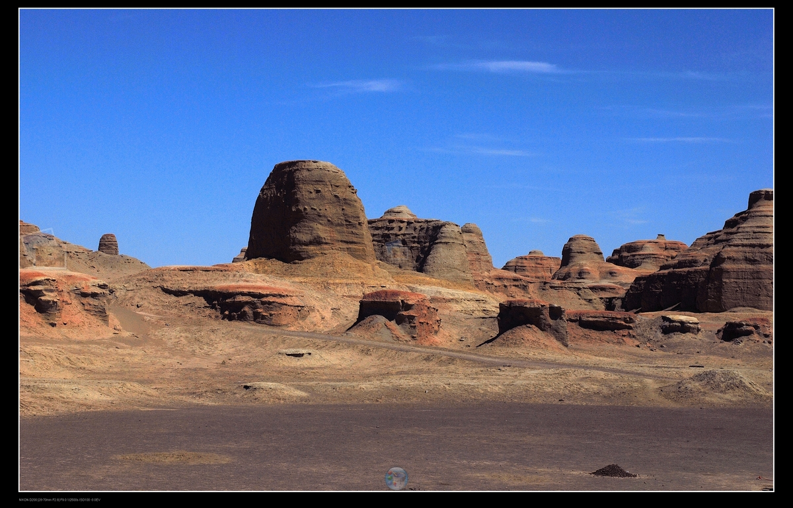

>    “当我走遍大江南北，最美的还是我们的新疆”，父辈们的歌声总在我耳际回响，带给我很多的遐想。对于19岁的我来讲，我没有那么好的运气游遍祖国的名山大川，经历最多的也还是这片生我养我的热土——新疆。

>说到我的家乡，流传着一句话：不到新疆，不知道祖国之大。这片占据国土面积六分之一的雄阔大地，似一枚定海神针稳稳坐落在祖国西北边陲，经历了千年风雨，百年沧桑，用宽大有力的臂膀接纳了汉、维、哈、回、锡等47个民族的孩子，如同一部正在上演的恢弘的西部大片，有赏心悦目的民俗风情，有心驰神往的奇观异景，有传奇不朽的英雄史诗，有继往开来的热血儿郎。我在它的故事里长大，在它的故事里沉醉。

>新疆的美丽，不是三言两语就能道清楚的，话不多说，直接上图。

>伊犁的美何止于此?那拉提草原、赛里木湖、姑娘追、叼羊……哪一样不是美到极致?哪一样美不是大气磅礴?大美新疆，真是实至名归。我敢断定，也惟有在这里能上演《十二木卡姆》，惟有在这里能诞生《江格尔》、《玛纳斯》，惟有在这里牧歌悠扬、骏马飞驰。

>当然，除了美丽的自然景观，也少不了乌鲁木齐国际大巴扎等人文景观。

>还有让人望而生畏的荒漠与雅丹地貌群。

>几张图片，根本无法道尽新疆的美丽，更多的美丽，还请大家亲自去探索。