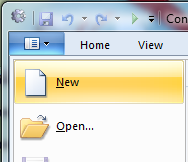
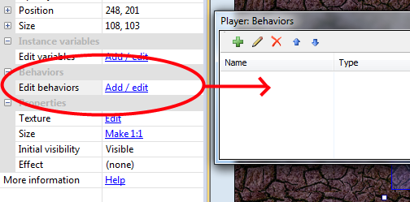
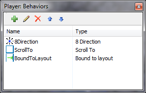
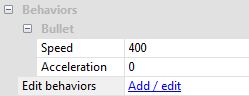
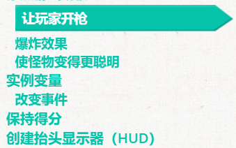

# 游戏开发技术博客
## 安装Construct 2
> 制作一个HTML5小游戏，首先下载Construct 2
[点击下载](https://www.scirra.com/construct2)
## 入门
启动Construct 2.单击File按钮，然后选择New。

您将看到“模板或示例”对话框。这会显示您可以随意调查的示例和模板列表。现在，只需单击框底部的'open',即可创建一个空白的空项目。

## 插入对象
双击布局中的空格以插入新对象。出现“ 插入新对象”对话框后，双击“平铺背景”对象将其插入。插入如下背景图片。

之后我根据提示双击‘TiledBackground’,并打开上图,调整其大小为1280,1024。

选择图层选项，修改背景图层名称并锁定背景图层。再添加新图层并命名为“Main”。

添加游戏对象：
1. 双击以插入新对象
2. 双击 “Sprite”对象。
3. 当鼠标变为十字准线时，单击布局中的某个位置。工具提示应为“Main”。（请记住这是活动布局。）
4. 弹出纹理编辑器。单击打开图标，然后加载四个纹理中的一个。
5. 关闭纹理编辑器，保存更改。您现在应该在布局中看到对象！

再添加action：
- 8方向运动。这使您可以使用箭头键移动对象。它会很好地适应玩家的运动。
- 子弹运动。这只是以当前角度向前移动一个物体。它对玩家的子弹很有用。尽管有这个名字，它也可以很好地移动怪物 - 因为所有的移动都是以某种速度向前移动物体。
- 滚动到。这使得屏幕在移动时跟随对象（也称为滚动）。这对玩家有用。
- 绑定到布局。这将停止一个物体离开布局区域。这对玩家也很有用，所以他们不能在游戏区域外游荡！
- 破坏外部布局。而不是停止离开布局区域的对象，如果它停止，则会破坏它。它对我们的子弹很有用。没有它，子弹将永远飞离屏幕，总是占用一点内存和处理能力。相反，我们应该在他们离开布局后销毁子弹。
- 淡出。这逐渐使物体淡出，我们将用于爆炸。

单击player，在属性栏中，如图所示进行操作

打开“Player:Behaviors”窗口后，点击绿色的添加按钮，依次添加如下行为。

添加一些其他行为：
 - 将Bullet移动和Destroy外部布局添加到Bullet对象（没有惊喜）
- 将Bullet移动添加到Monster对象（因为它也向前移动）
- 将Fade行为添加到Explosion对象（因此它逐渐消失）出现后）。

更改怪物的速度:

创建更多的monster，注意monster的初始位置不应该太靠近player。

## 活动
在"Event sheet 1"中添加活动。选择“add event”中的"system"。

双击进入后，选择条件并插入.

用以上方法完成下列event 和 action 的插入。

[详细教程请点击](https://www.scirra.com/tutorials/37/beginners-guide-to-construct-2/page-3#h2a8)

经过幸苦的努力，一个HTML5小游戏就完成了。