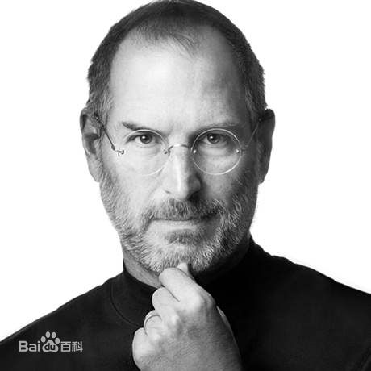
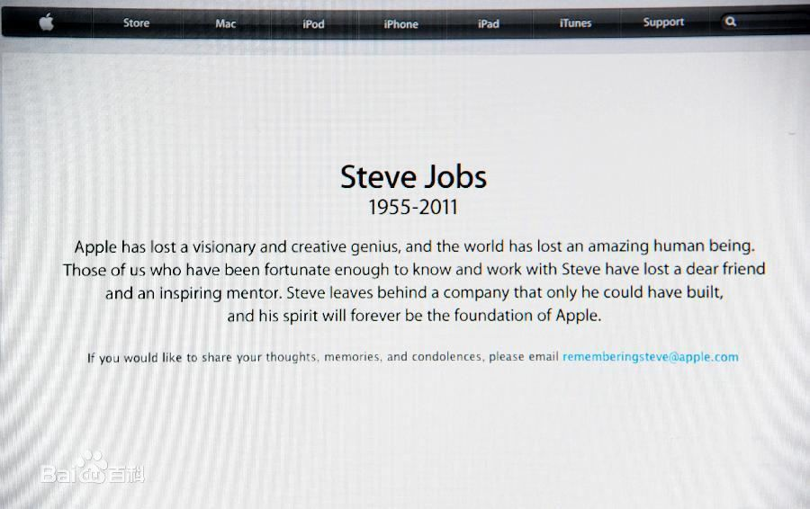
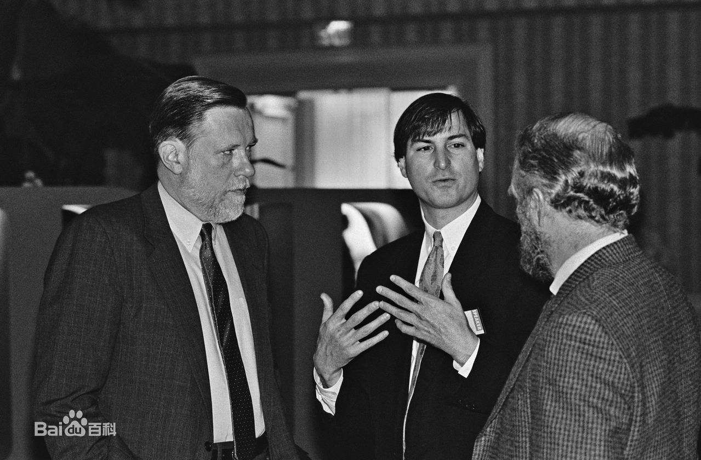
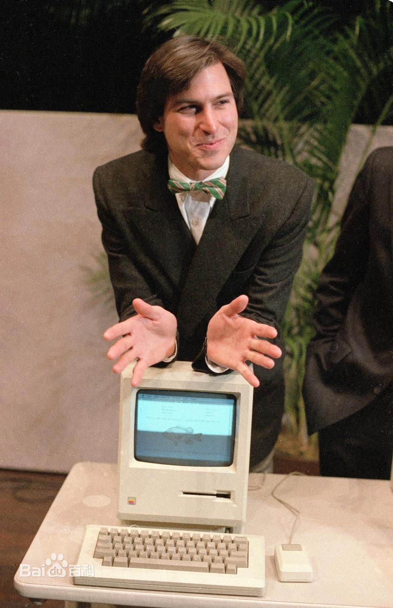
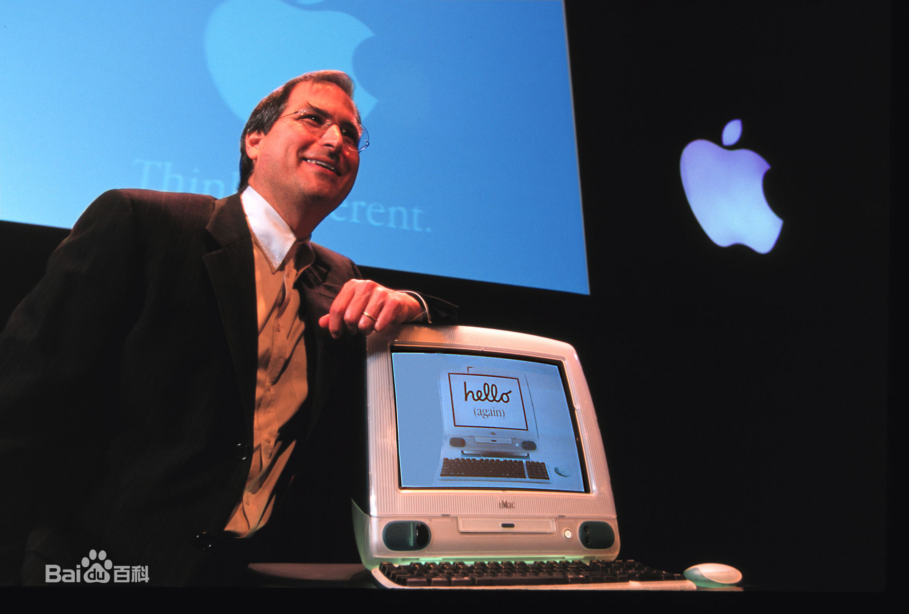
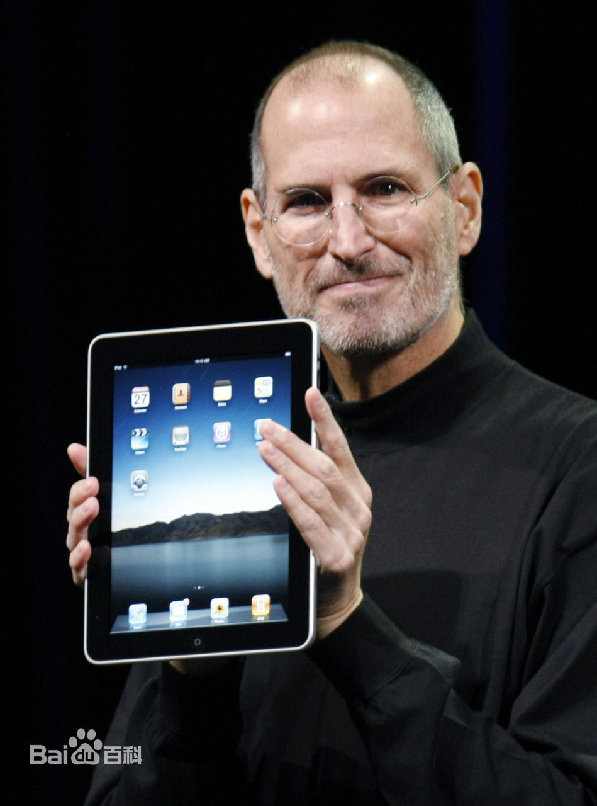
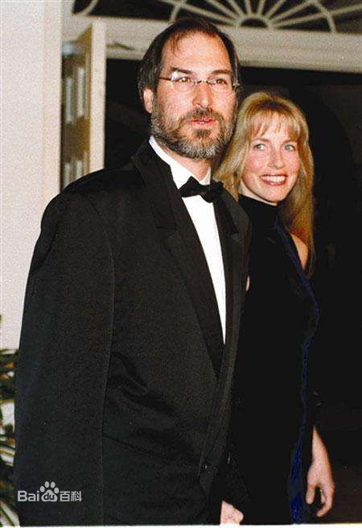
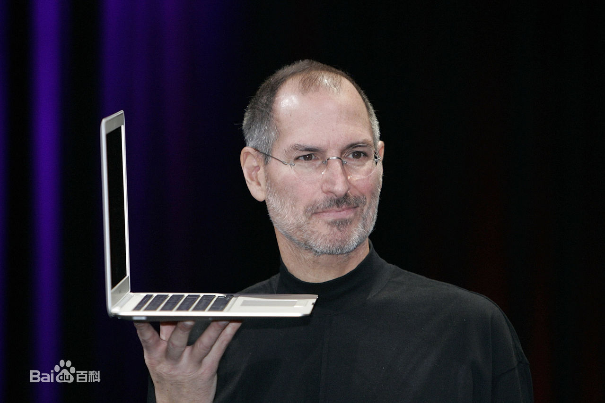

# 史蒂夫·乔布斯
##  简要生平
>史蒂芬·保罗·乔布斯（英语：Steven Paul Jobs，1955年2月24日－2011年10月5日），通称史蒂夫·乔布斯（英语：Steve Jobs），是一名美国企业家、营销家和发明家，苹果公司的联合创始人之一，曾任董事长及首席执行官职位，NeXT创办人及首席执行官，也是皮克斯动画的创办人并曾任首席执行官，2006年为华特迪士尼公司的董事会成员。

>乔布斯在1970年代末与苹果公司另一始创人斯蒂芬·沃兹尼亚克及首任投资者迈克·马库拉协同其他人设计、开发及销售Apple II系列。在1980年代初，乔布斯是最早看到施乐帕洛奥图中心（Xerox PARC）的鼠标驱动图形用户界面的商业潜力，并将其应用于Apple Lisa及一年后的麦金塔计算机。

 1985年，在董事会的斗争失势后，乔布斯离开苹果公司及成立了NeXT公司(一间计算机平台开发公司，专门从事高等教育及商业市场)在1986年，他收购了卢卡斯影业的计算机绘图部门，成立了皮克斯（Pixar）。他被誉为《玩具总动员》（1995年）的运行制片人。他一直担任皮克斯动画的首席执行官并持有50.1%的股份，直到公司在2006年被华特迪士尼公司收购，此项收购使乔布斯成为迪士尼公司的最大个人股东（有7.4%的股份）及董事会成员。
 
 
 
  在1996年，苹果公司董事会决议买下NeXT公司，把乔布斯带回他参与创立，却正在垂死边缘的苹果公司担任临时CEO。他在2000年起成为正式CEO，带领苹果辉煌的iPod、iPhone、iPad时代的到来。 从2003年10月起，乔布斯与胰腺神经内分泌肿瘤奋战了8年，最终于2011年8月辞任首席执行官一职，在他第3次病假期间，乔布斯当选为苹果公司的董事长。

>在他生活的年代里，乔布斯被认为是计算机业界与娱乐业界的标志性人物，同时人们也把他视作麦金塔计算机、iPod、iPhone、iPad等知名数字产品的缔造者。他亦曾七次登上《时代杂志》的封面，被认为是当时全球最为成功的商人之一。

>2007年，乔布斯被《财富》杂志评为了年度最强有力商人。乔布斯的生涯极大地影响了硅谷风险创业的传奇，他将美学至上的设计理念在世界上推广开。他对简约及便利设计的推崇为他赢得了许多忠实追随者。

## 家庭
>乔布斯是来自叙利亚阿拉伯人移民至美国的阿卜杜拉法塔赫·约翰·钱德里（Abdulfattah "John" Jandali）与德国裔美国人前妻乔安妮·席贝尔所生的长子，当年他们二人仍在威斯康辛大学就读，女友乔安妮未婚怀孕，但二人的婚姻因钱德理来自叙利亚而遭女方父亲反对。在乔安妮父亲去世后，二人才结婚并生有一女莫娜·辛普森，莫娜后来成为了作家，在1996年出版的图书《好人》（A Regular Guy）中将史蒂夫作为其主人公的原型。

## 传记

>1. 乔布斯生前授权，沃尔特·艾萨克森撰写的乔布斯传记《Steve Jobs》（台湾译名:《賈伯斯傳》,中国大陆译名:《史蒂夫·乔布斯传》）于2011年10月24日上午10:05在全球同步发行。该书尽管是乔布斯授权，并由乔布斯及其相关人士（包括亲友、同事、对手等的100多人）提供资料，但乔布斯本身并未有对自传内容提及任何修改意见，甚至生前连即将完成的书稿都没有看过。
>1. 成为乔布斯

## 相关电影
1. 《硅谷传奇》，1999年上映；其中由诺亚·怀勒饰演乔布斯。

2. 《乔布斯》（Jobs）：于2013年8月上映，由约书亚迈克·斯特恩导演，艾希顿·库奇（Ashton Kutcher）主演。

3. 《史蒂夫·喬布斯 (电影)》（Steve Jobs）：于2015年上映，改编自《史蒂夫·乔布斯传》，由丹尼·鲍伊导演，艾伦·索金编剧，迈克尔·法斯宾德主演。

