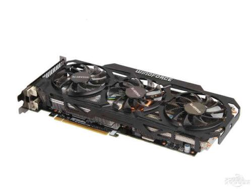

# 技术科普——显卡

>谈及显卡，我的最初印象是“与呈像有关、对玩游戏、看电影很重要”。而在课上学习了色彩表示的基本原理后，我对这一计算机中的重要硬件产生了兴趣，通过查阅一些资料，简单地列出了显卡的一些基本分类、结构、工作原理及参数，供像我一样的小白参考。

>首先，让我们来看一下显卡的定义：显卡全称显示接口卡，又称显示适配器，是计算机最基本配置、最重要的配件之一。显卡作为电脑主机里的一个重要组成部分，是电脑进行数模信号转换的设备，承担输出显示图形的任务。显卡接在电脑主板上，它将电脑的数字信号转换成模拟信号让显示器显示出来，同时显卡还是有图像处理能力，可协助CPU工作，提高整体的运行速度。

>显卡主要分为集成显卡和独立显卡。其中集成显卡是将显示芯片、显存及其相关电路都集成在主板上，与其融为一体的元件，优点是功耗低发热少价格低，但图形处理能力有限，且如果要更换可能会牵涉到主板。而独立显卡则是显示芯片、显存及其相关电路单独做在一块电路板上，自成一体而作为一块独立的板卡存在，它优点是单独安装有显存，一般不占用系统内存，性能大多强于集成显卡，且也相对容易更换。但它的费用较高，功耗也较高，且由于发热量大，可能会占用更大空间（一些显卡装有风扇）。

>显卡的主要部件包括GPU、显存、显卡BIOS和显卡PCB板，他们分别类似于主板的CPU、内存、主板BIOS和主板。GPU是图形处理器，它的存在替代了CPU的一部分工作，且它在图形的处理上比CPU 更有效率。显存是显卡上的内存，其左右与内存相似，是暂存已处理和待处理的数据，处理器性能越强，对显存的需求也就越高。显卡BIOS是Basic Input Output System的简称，也就是“基本输入输出系统”。显卡BIOS又称VGA BIOS，主要用于存放显示芯片与驱动程序之间的控制程序。显卡BIOS固化在显示卡所带的一个专用存储器里。BIOS 中储存了显示卡的硬件控制程序和相关信息。可以说BIOS 是显示卡的“神经中枢”。而显卡PCB板则与主板很相似，将显卡各部分连通并接在主板上。

>显卡的主要参数有流处理器数量、核心频率、显存频率、纹理单元、光栅单元、显存容量、显存类型、显存带宽、显卡显存频率等。其中流处理器的数量与处理性能直接相关，但通常与流处理单元以一定比例对应，无法任意增加。核心频率是为数不多的可由用户调节以提高性能的参数，它对性能的提升与流处理器数正相关，需要注意的是：流处理器数量多，性能提升多，但发热也不容忽视，而流处理器数量少，则提高频率影响不大。因此可以说核心频率只起到辅助、调节作用。处理器性能高的显卡需要大的带宽更大的内存，而对于高分辨率，则光栅单元和显存带宽都很重要，因此它们可以从侧面反映显卡的档次。总而言之，判断一个显卡的性能需要从多个角度去看，某一方面过高而其他地方跟不上，也无法达到预期的效果。 

